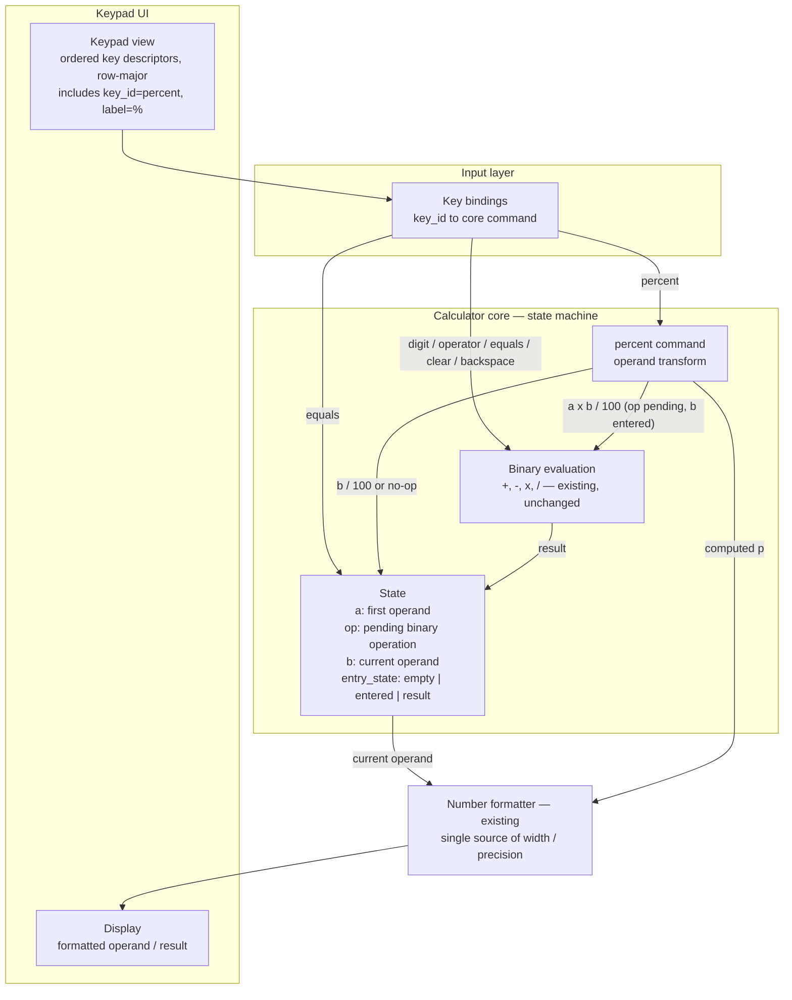

## Обзор

The change adds exactly one command, `percent`, to the calculator and exactly one key descriptor that
invokes it. Percent is modelled as an **operand transform**, not as a binary operation: it rewrites
the current operand (`p = a × b ÷ 100` while a binary operation is pending, `b ÷ 100` otherwise) and
leaves the pending operation and the first operand in place, so the following `=` evaluates `a op p`
through the unchanged evaluation path. Each press applies the rule once to the operand current at that
moment, and with a pending operation whose second operand has not been entered `%` is a no-op.

Precision parity (`REQ-003`) is achieved by construction rather than by duplicated rules: `%` reuses
the existing arithmetic path and the existing number formatter, and commits exactly the displayed
(rounded) value as the operand — no hidden digits survive into `=` (DEC-2).

The keypad is a data-driven, ordered list of key descriptors. The `%` key is appended in a cell that
does not displace any pre-existing key, and no pre-existing descriptor is edited, so the constraint
"no existing key removed, renamed or reordered" (`REQ-001` AC-2, AC-3) holds mechanically, and the
regression guarantee for sequences that never press `%` (AC-4) follows from the absence of changes on
the existing command paths.

Nothing in the requirements forces a change to the evaluation core's public command semantics: `=`,
`+`, `-`, `×`, `÷`, `C`, backspace and the digit keys keep their behaviour. Scientific functions and
any expression-parsing mode are out of scope and are not introduced.

Note on numbering: the baseline contains one placeholder decision, `adr:example-product:0001`
(`.factory/decisions/ADR-000-example.md`). The ADRs of this ChangeSet therefore take the next free
numbers 0002–0004; these ids are stable comment anchors and will not be renumbered.

## Компоненты

| Компонент | Ответственность | Требования / ADR |
| --- | --- | --- |
| Keypad view | Renders the ordered key descriptors row-major; the new `%` descriptor appears in the keypad label list | `REQ-001` AC-1…AC-3; `ADR-004` |
| Key bindings / input dispatch | Maps a pressed `key_id` to a core command; adds the `percent` binding only | `ADR-004` |
| Calculator core — state machine | Holds `(a, op, b, entry_state)` and executes commands; the only owner of evaluation state | `REQ-002`, `REQ-004`; `ADR-002` |
| `percent` command | Operand transform: `a × b ÷ 100` with a pending operation and an entered second operand; `b ÷ 100` otherwise; no-op when the second operand is missing; never errors, never blanks | `REQ-002`, `REQ-004`; `ADR-002` |
| Binary evaluation `+ - × ÷` | Existing arithmetic path, unchanged; reused by both `%` and `=` | `REQ-003`; `ADR-003` |
| Number formatter | Existing formatter; the single source of display width, rounding and notation | `REQ-003`; `ADR-003` |
| Display | Shows the formatted current operand / result | `REQ-003`; `ADR-003` |

## Решения

| ADR | Решение |
| --- | --- |
| [ADR-002 — Percent as a command in the evaluation core](decisions/ADR-002-percent-evaluation-semantics.md) | `%` is a core command that transforms the current operand, retains the pending operation and the first operand, and is a no-op when the second operand is missing. |
| [ADR-003 — Display precision and formatting parity](decisions/ADR-003-display-precision-parity.md) | `%` reuses the existing arithmetic path and formatter and commits exactly the displayed value as the operand; no percent-specific rounding or formatting exists. |
| [ADR-004 — Keypad composition of the `%` key](decisions/ADR-004-keypad-composition.md) | The keypad stays a data-driven ordered list; one `percent` descriptor is appended without editing, renaming, reordering or displacing any pre-existing key. |
