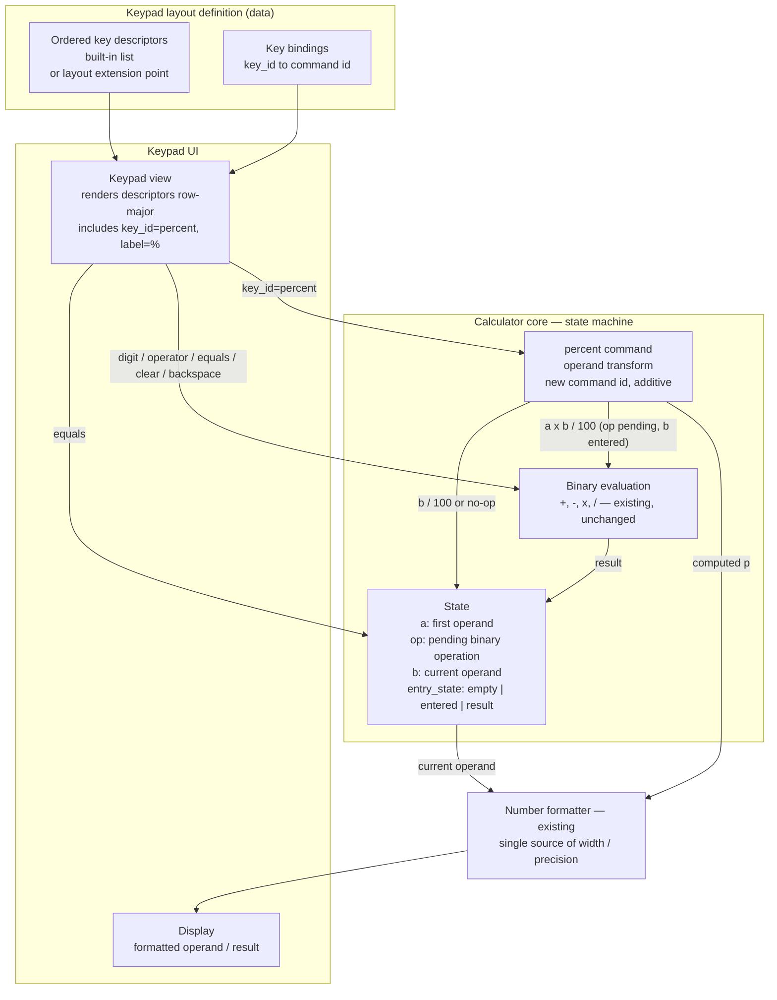

## Обзор

The change adds exactly one command, `percent`, to the calculator and exactly one key descriptor that
invokes it. Percent is modelled as an **operand transform**, not as a binary operation: it rewrites
the current operand (`p = a × b ÷ 100` while a binary operation is pending, `b ÷ 100` otherwise) and
leaves the pending operation and the first operand in place, so the following `=` evaluates `a op p`
through the unchanged evaluation path. Each press applies the rule once to the operand current at that
moment, and with a pending operation whose second operand has not been entered `%` is a no-op.

Precision parity (`REQ-003`) is achieved by construction rather than by duplicated rules: `%` reuses
the existing arithmetic path and the existing number formatter, and commits exactly the displayed
(rounded) value as the operand — no hidden digits survive into `=` (DEC-2). The format-then-parse
boundary lives behind the display binding, so nothing on that path is visible to the keypad.

The keypad is a data-driven, ordered list of key descriptors. The `%` key enters that structure as
**data only**: one descriptor plus one `key_id → command` binding. Rework order `rw_a63e37d99e9b4589`
asks for this to happen through the keypad's existing layout extension mechanism when one exists, and
for the minimal contract change to be justified otherwise. Nothing in the context available to this
phase declares such a mechanism (no layout registry, plugin point, configuration or profile surface is
referenced by the baseline artifacts, and this phase cannot inspect the implementation's source tree),
so the design covers both realities: if the implementation exposes a registration/override point, the
descriptor and the binding are entered there and the built-in layout definition is not edited at all;
otherwise the single descriptor is appended to the built-in ordered list at a free cell. Both
branches are observationally equivalent (`SCN-001`, `SCN-008` read labels and displays, not the
structure that produced them) and in both the keypad's contract is untouched — descriptor schema,
render/bind/query signatures, `key_id` semantics and the label, command and relative order of every
pre-existing key are unchanged, so the keypad carries a `ui` impact only. The corresponding additive
change on the core side (one new command id in the dispatch table) is recorded as `public_api` in
`ADR-002`; the keypad never owns percent state.

Nothing in the requirements forces a change to the evaluation core's public command semantics: `=`,
`+`, `-`, `×`, `÷`, `C`, backspace and the digit keys keep their behaviour. Scientific functions and
any expression-parsing mode are out of scope and are not introduced.

Note on numbering: the baseline contains one placeholder decision, `adr:example-product:0001`
(`.factory/decisions/ADR-000-example.md`). The ADRs of this ChangeSet take the next free numbers
0002–0004; these ids are stable comment anchors and will not be renumbered. This round revises those
three ADRs in place and adds no new ADR.

## Компоненты

| Компонент | Ответственность | Требования / ADR |
| --- | --- | --- |
| Keypad layout definition (built-in ordered descriptor list) or layout extension point | Holds the ordered key descriptors and the `key_id → command id` bindings; receives the one new `percent` descriptor and its binding — through the implementation's extension point when one exists, otherwise appended to the built-in list; no schema, signature or semantic change | `REQ-001` AC-1…AC-3; `ADR-004` |
| Keypad view | Renders the ordered key descriptors row-major; the new `%` descriptor appears in the keypad label list; the renderer contract is unchanged | `REQ-001` AC-1…AC-3; `ADR-004` |
| Key bindings / input dispatch | Maps a pressed `key_id` to a core command id; adds the `percent` binding only, and no keypad-side handler or callback | `ADR-004`; `ADR-002` |
| Calculator core — state machine | Holds `(a, op, b, entry_state)` and executes commands; the only owner of evaluation state | `REQ-002`, `REQ-004`; `ADR-002` |
| `percent` command | Operand transform: `a × b ÷ 100` with a pending operation and an entered second operand; `b ÷ 100` otherwise; no-op when the second operand is missing; never errors, never blanks; registered as one additive command id | `REQ-002`, `REQ-004`; `ADR-002` |
| Binary evaluation `+ - × ÷` | Existing arithmetic path, unchanged; reused by both `%` and `=` | `REQ-003`; `ADR-003` |
| Number formatter | Existing formatter; the single source of display width, rounding and notation | `REQ-003`; `ADR-003` |
| Display | Shows the formatted current operand / result | `REQ-003`; `ADR-003` |

## Решения

| ADR | Решение |
| --- | --- |
| [ADR-002 — Percent as a command in the evaluation core](decisions/ADR-002-percent-evaluation-semantics.md) | `%` is a core command that transforms the current operand, retains the pending operation and the first operand, and is a no-op when the second operand is missing; it is registered additively as one new command id, so existing commands and the keypad binding shape are unchanged. |
| [ADR-003 — Display precision and formatting parity](decisions/ADR-003-display-precision-parity.md) | `%` reuses the existing arithmetic path and formatter and commits exactly the displayed value as the operand; no percent-specific rounding or formatting exists, and the format-then-parse boundary stays inside the core, invisible to the keypad. |
| [ADR-004 — Keypad composition of the `%` key](decisions/ADR-004-keypad-composition.md) | The key is added as data through the layout's own extension point when one exists, otherwise as one appended descriptor in the built-in ordered list; either way the keypad's public contract (schema, signatures, `key_id` semantics, pre-existing labels and order) is untouched and the impact is `ui` only. |
