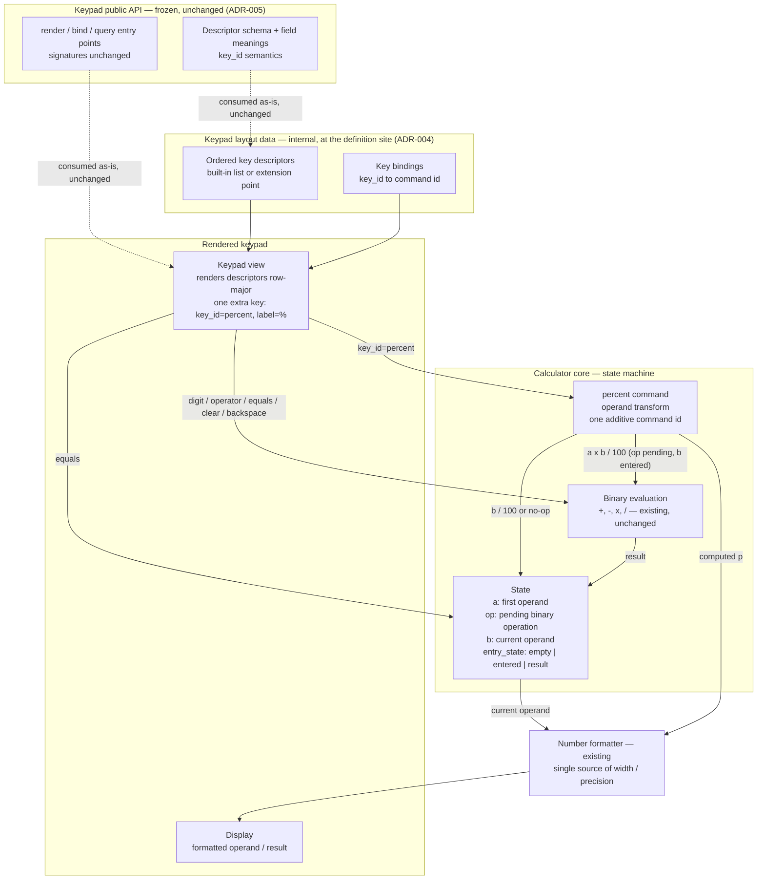

## Обзор

The change adds exactly one command, `percent`, to the calculator and exactly one key descriptor that
invokes it. Percent is modelled as an **operand transform**, not as a binary operation: it rewrites the
current operand (`p = a × b ÷ 100` while a binary operation is pending, `b ÷ 100` otherwise) and leaves
the pending operation and the first operand in place, so the following `=` evaluates `a op p` through
the unchanged evaluation path. Each press applies the rule once to the operand current at that moment,
and with a pending operation whose second operand has not been entered `%` is a no-op.

Precision parity (`REQ-003`) is achieved by construction rather than by duplicated rules: `%` reuses the
existing arithmetic path and the existing number formatter, and commits exactly the displayed (rounded)
value as the operand — no hidden digits survive into `=` (DEC-2). The format-then-parse boundary lives
behind the display binding, so nothing on that path is visible to the keypad.

The design separates three layers of the keypad, so that the rework order's question — *can `%` be added
without changing the keypad's public API?* — has a checkable answer:

| Layer | Content | Delta of this change |
| --- | --- | --- |
| Keypad public API — frozen (`ADR-005`) | descriptor schema and field meanings, render/bind/query entry points and signatures, `key_id` semantics | none |
| Keypad layout data (`ADR-004`) | the values: the ordered key descriptors and the `key_id → command id` bindings | one descriptor value + one binding value |
| Rendered keypad (`REQ-001`) | the labels and their order, read row-major by `SCN-001` | one more key, labelled `%` |

The `%` key enters the layout data as **data only**, written in the way the implementation already keeps
layout values. Rework order `rw_a63e37d99e9b4589` asks for the key to be added through the keypad's
existing layout extension mechanism when one exists, and for the minimal change to be justified
otherwise. Nothing in the context available to this phase declares such a mechanism (no layout registry,
plugin point, configuration or profile surface is referenced by the baseline artifacts, and this phase
cannot inspect the implementation's source tree), so `ADR-004` is branch-complete: if the implementation
exposes a registration/override point, both values are entered there and the built-in layout definition
is not edited at all; otherwise both values are placed at the construction site of the built-in layout
data, using only constructs already present there. Either way the public API is untouched (`ADR-005`):
what changes is the value of internal layout data, so the fallback's contract delta is zero, and the two
branches are observationally equivalent (`SCN-001`, `SCN-008` read labels and displays, not the
structure that produced them). The corresponding additive change on the core side — one new command id
in the dispatch table — is recorded as `public_api` in `ADR-002`; the keypad never owns percent state.

Nothing in the requirements forces a change to the evaluation core's public command semantics: `=`, `+`,
`-`, `×`, `÷`, `C`, backspace and the digit keys keep their behaviour. Scientific functions and any
expression-parsing mode are out of scope and are not introduced.

Note on numbering: the baseline contains one placeholder decision, `adr:example-product:0001`
(`.factory/decisions/ADR-000-example.md`). The ADRs of this ChangeSet take the next free numbers
0002–0005; these ids are stable comment anchors and will not be renumbered. This round revises
`ADR-002`, `ADR-003` and `ADR-004` in place and adds `ADR-005`, which fixes the public-API boundary the
rework order's instruction relies on.

## Компоненты

| Компонент | Ответственность | Требования / ADR |
| --- | --- | --- |
| Keypad public API (descriptor schema, field meanings, entry points, `key_id` semantics) | Frozen by this design: defines which descriptors the keypad accepts and which entry points it offers; the change consumes it unchanged and adds no element to it | `ADR-005`; `REQ-001` AC-1…AC-4 |
| Keypad layout data — built-in ordered descriptor list or layout extension point | Holds the values: the ordered key descriptors and the `key_id → command id` bindings; receives the one new `percent` descriptor and its binding — through the implementation's extension point when one exists, otherwise at the built-in list's construction site; internal data, not API | `REQ-001` AC-1…AC-3; `ADR-004` |
| Keypad view | Renders the ordered key descriptors row-major; the new `%` descriptor appears in the keypad label list; the renderer contract is unchanged | `REQ-001` AC-1…AC-3; `ADR-004`; `ADR-005` |
| Key bindings / input dispatch | Maps a pressed `key_id` to a core command id; adds the `percent` binding value only, and no keypad-side handler or callback | `ADR-004`; `ADR-002`; `ADR-005` |
| Calculator core — state machine | Holds `(a, op, b, entry_state)` and executes commands; the only owner of evaluation state | `REQ-002`, `REQ-004`; `ADR-002` |
| `percent` command | Operand transform: `a × b ÷ 100` with a pending operation and an entered second operand; `b ÷ 100` otherwise; no-op when the second operand is missing; never errors, never blanks; registered as one additive command id | `REQ-002`, `REQ-004`; `ADR-002` |
| Binary evaluation `+ - × ÷` | Existing arithmetic path, unchanged; reused by both `%` and `=` | `REQ-003`; `ADR-003` |
| Number formatter | Existing formatter; the single source of display width, rounding and notation | `REQ-003`; `ADR-003` |
| Display | Shows the formatted current operand / result | `REQ-003`; `ADR-003` |

## Решения

| ADR | Решение |
| --- | --- |
| [ADR-002 — Percent as a command in the evaluation core](decisions/ADR-002-percent-evaluation-semantics.md) | `%` is a core command that transforms the current operand, retains the pending operation and the first operand, and is a no-op when the second operand is missing; it is registered additively as one new command id on the core's command surface, so existing commands and the keypad's side of the binding are unchanged. |
| [ADR-003 — Display precision and formatting parity](decisions/ADR-003-display-precision-parity.md) | `%` reuses the existing arithmetic path and formatter and commits exactly the displayed value as the operand; no percent-specific rounding or formatting exists, and the format-then-parse boundary stays inside the core, invisible to the keypad and to its public API. |
| [ADR-004 — Keypad composition of the `%` key](decisions/ADR-004-keypad-composition.md) | The key is added as two data values — one descriptor and one binding — through the layout's own extension point when one exists, otherwise at the construction site of the built-in layout data; both branches have an empty contract delta, and the keypad's pre-existing labels, order and behaviour are untouched. |
| [ADR-005 — Keypad public API boundary and the key-addition rule](decisions/ADR-005-keypad-api-boundary.md) | The keypad's public API is its exported/consumed surface (descriptor schema and field meanings, entry points and signatures, `key_id` semantics); the shipped layout data and the rendered result are outside it. Adding a key is therefore a data change and never an API change unless it introduces a new exported element; this change introduces none, so the keypad's API delta is empty and is checkable by an exported-surface diff. |
